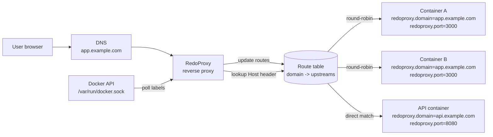

# RedoProxy

A reverse proxy for Docker containers with automatic service discovery and automatic TLS via Let's Encrypt. Inspired by [reproxy](https://github.com/umputun/reproxy) project.

RedoProxy polls the Docker socket, discovers containers with specific labels, and automatically routes traffic to them. It supports both HTTP and HTTPS modes, with transparent Let's Encrypt certificate provisioning.

## How it works

1. RedoProxy polls the Docker API on a configurable interval
2. It discovers running containers that have `redoproxy.enabled=true` label
3. Routes are built from the `redoproxy.domain` and `redoproxy.port` labels
4. Incoming HTTP/HTTPS requests are proxied to the matching container
5. In TLS mode, Let's Encrypt certificates are automatically obtained and cached



When several containers use the same `redoproxy.domain`, RedoProxy groups them into one route and sends requests to the upstreams in round-robin order. This lets one domain be served by multiple replicas while other domains continue to route to their own containers.

## Docker labels

| Label | Required | Description |
|-------|----------|-------------|
| `redoproxy.enabled` | yes | Set to `"true"` to register the container |
| `redoproxy.domain` | yes | Domain name to route to this container |
| `redoproxy.port` | yes | Internal container port to proxy traffic to |
| `redoproxy.max_body_size` | no | Maximum request body size in bytes for this domain. Unset or `0` disables the limit |
| `redoproxy.concurrent_requests_limit` | no | Maximum number of in-flight requests for this domain. Unset or `0` disables the limit |

Only containers in the same Docker network as RedoProxy are discovered. Currently only a single network is supported.

## Quick start

### 1. Create a shared network

```bash
docker network create proxy-net
```

### 2. Start RedoProxy

```bash
docker run -d \
  --name redoproxy \
  --network proxy-net \
  -p 80:8080 \
  -v /var/run/docker.sock:/var/run/docker.sock:ro \
  -e DISCOVERY_INTERVAL=60s \
  -e TLS_ENABLED=false \
  ghcr.io/mikhail-angelov/redoproxy:latest
```

### 3. Start your app with labels

```yaml
services:
  app:
    image: my-app
    labels:
      redoproxy.enabled: "true"
      redoproxy.domain: "example.com"
      redoproxy.port: "8765"
    networks:
      - proxy-net

networks:
  proxy-net:
    external: true
```

RedoProxy will discover the container and start routing traffic to it.

## Configuration

All configuration is done via environment variables.

| Variable | Default | Description |
|----------|---------|-------------|
| `PORT` | `8080` | Internal HTTP listen port (non-TLS mode / health check) |
| `HTTP_PORT` | `80` | External HTTP port for ACME challenge server |
| `HTTPS_PORT` | `443` | External HTTPS port |
| `TLS_ENABLED` | `false` | Enable TLS with Let's Encrypt (`"true"` or `"false"`) |
| `DOCKER_NETWORK` | *(auto-detect)* | Docker network name to scan for containers |
| `DISCOVERY_INTERVAL` | `60s` | How often to poll Docker for route changes |
| `ACME_EMAIL` | *(empty)* | Email for Let's Encrypt registration |
| `ACME_CACHE_DIR` | `/data/autocert` | Directory to cache TLS certificates |
| `ACME_STAGING` | `false` | Use Let's Encrypt staging environment |

When `DOCKER_NETWORK` is not set, RedoProxy auto-detects its network by matching its own container ID against the Docker API response.

### Health check

RedoProxy responds with `200 OK` on `GET /health` at the internal `PORT`. Example with the default port:

```bash
wget -qO- http://127.0.0.1:8080/health
# ok
```

## Deployment with Docker Compose

### HTTP mode (no TLS)

```yaml
services:
  redoproxy:
    image: ghcr.io/mikhail-angelov/redoproxy:latest
    ports:
      - "80:8080"
    volumes:
      - /var/run/docker.sock:/var/run/docker.sock:ro
    environment:
      PORT: "8080"
      DISCOVERY_INTERVAL: "10s"
      DOCKER_NETWORK: "proxy-net"
      TLS_ENABLED: "false"
    healthcheck:
      test: ["CMD", "wget", "-qO-", "http://127.0.0.1:8080/health"]
      interval: 10s
      timeout: 3s
      retries: 3
    networks:
      - proxy-net

  app:
    image: nginx:alpine
    labels:
      redoproxy.enabled: "true"
      redoproxy.domain: "example.local"
      redoproxy.port: "80"
    networks:
      - proxy-net

networks:
  proxy-net:
    external: true
```

### HTTPS mode (with Let's Encrypt)

```yaml
services:
  redoproxy:
    image: ghcr.io/mikhail-angelov/redoproxy:latest
    ports:
      - "80:80"
      - "443:443"
    volumes:
      - /var/run/docker.sock:/var/run/docker.sock:ro
      - certs:/data/autocert
    environment:
      DISCOVERY_INTERVAL: "60s"
      TLS_ENABLED: "true"
      HTTP_PORT: "80"
      HTTPS_PORT: "443"
      ACME_EMAIL: "admin@example.com"
      ACME_CACHE_DIR: "/data/autocert"
    healthcheck:
      test: ["CMD", "wget", "-qO-", "http://127.0.0.1:8080/health"]
      interval: 60s
      timeout: 3s
      retries: 3
    networks:
      - proxy-net

  app:
    image: nginx:alpine
    labels:
      redoproxy.enabled: "true"
      redoproxy.domain: "example.local"
      redoproxy.port: "80"
    networks:
      - proxy-net

volumes:
  certs:

networks:
  proxy-net:
    external: true
```

### Testing with ACME staging

Use `docker-compose-st.yml` to test certificate provisioning against the Let's Encrypt staging environment:

```yaml
environment:
  ACME_STAGING: "true"
  ACME_EMAIL: "admin@example.com"
```

## Features

- **Automatic service discovery** — polls the Docker socket and updates routes periodically
- **Let's Encrypt TLS** — automatic certificate issuance and renewal via autocert
- **HTTP ACME challenge server** — serves HTTP-01 challenges alongside a 301 redirect to HTTPS
- **Health check endpoint** — `/health` returns `200 OK` on the HTTP server (before TLS)
- **Access logging** — structured logs via `log/slog` with method, host, path, status, duration, bytes, remote address, and user agent
- **Forwarded headers** — sets `X-Real-Ip`, `X-Forwarded-For`, `X-Forwarded-Host`, `X-Forwarded-Proto`, `X-Request-Id`
- **Per-domain limits** — optional body-size and concurrent-request limits from Docker labels
- **Auto-network detection** — when `DOCKER_NETWORK` is not set, detects its own network from the Docker API
- **Minimal dependencies** — only depends on `golang.org/x/crypto` (autocert)

## Why I built this / tradeoffs

RedoProxy is built for running several pet projects on one VPS, each with its own domain, without manually editing reverse-proxy config every time a container is added or changed. The goal is a small self-hosting tool that can discover Docker services from labels and route traffic automatically.

- **Single Docker network** — RedoProxy uses one shared Docker network to keep the deployment model simple. This is enough for the intended VPS setup and avoids ambiguous routing across multiple networks.
- **Docker polling instead of events** — discovery polls Docker state on `DISCOVERY_INTERVAL` instead of subscribing to Docker events. Pet projects do not need immediate reaction to infrastructure changes, so polling every 10 seconds or 60 seconds is acceptable and simpler to operate.
- **Per-request proxy construction** — request handling builds a small `httputil.ReverseProxy` for the selected upstream on each request. Upstream connection pooling is still shared through a tuned transport, while route selection stays simple and explicit.
- **Conflicting labels on the same domain** — if more than one service shares the same domain and their per-domain settings differ, RedoProxy keeps the first deterministic value from the sorted upstream list. Different settings from later containers are ignored and logged as warnings.

## Development

### Prerequisites

- Go 1.26+

### Build

```bash
go build -o redoproxy .
```

### Test

```bash
go test ./...
go test -race ./...
```

### Docker build

```bash
docker build -t redoproxy .
```

## CI/CD

- **Tests** run on every push and pull request (`go test ./...`, `go vet`, `gofmt`, `golangci-lint`)
- **Release** builds and publishes a Docker image to `ghcr.io/mikhail-angelov/redoproxy` on every tag push matching `v*`

## License

MIT
